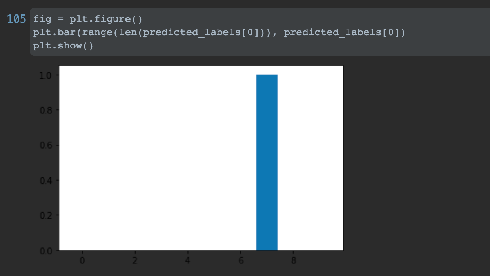

# Feb.07 Informal Response 
## Victoria Chang

#### Question A Splitting Data
The purpose of splitting the data into the training set and the testing set is to train the neural network based on the training set and test its validity with the testing set. This way, since the neural network has never been trained on the 
testing data, its prediction on the testing data can tell how well the neural network fit the data. Moreover, by comparing the predictions of the training set and that of the
testing set, one can tell if the model is overfit or underfit. 

#### Question B Layers of the Neural Network
The relu function sets negative input to 0, so it wouldn't cancel out other positive input and skew the data. The softmax function takes the calculated probabilities 
of each label and set the largest to 1 and the rest to 0. The last layer has 10 neurons because it matches the output: There are 10 labels of clothing.

#### Question C Optimizer and Loss Functions
The loss function calculate how good the estimate is, and the optimizer tweaks the parameters for the next round. The process repeats to produce more and more accurate answers. 

#### Question D 
1. There are 60000 two-dimensional data in the shape of [28,28] in the training set.
2. The length of the labels of the training set is 60000.
3. The shape of the images test set is 10000.

This is a random test image. The predicted label with highest probability is 7
![Why is it so hard just to insert an image](informal_response07_pic1.png）

