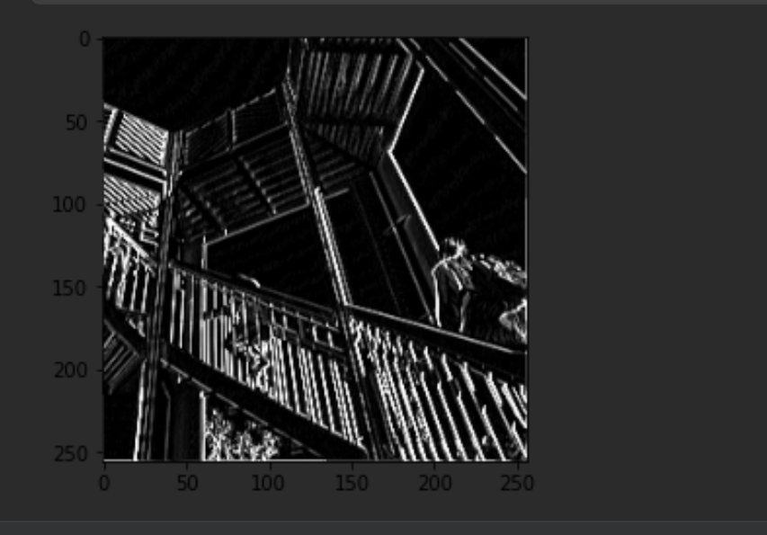

# Feb.07 Informal Response 
### Victoria Yuanyuan Chang

#### A. Convolutions
1. filter = [ [-1, -2, -1], [0, 0, 0], [1, 2, 1]] This filter accentuates vertical lines in the image.

Output:

2. filter = [ [-1, 0, 1], [-2, 0, 2], [-1, 0, 1]] This filter accentuates horizontal lines in the image.

Output:

3. filter = [ [1, 0, 0], [ 0, 0, 0], [0, 0, -1] ] This filter darkens the image.

Output:

4.The application of convolutions is helpful for computer vision is that it can extract features of the image so it's easier to label them according to these features.

#### B. Pooling
The following is the image with the filter that accentuate vertical line after pooling:

Pooling reduces irrelevant information in the image so that the relevant features can be further emphasized.
This pooling filter takes the four neighbors of each pixel, find the largest pixel and extract that pixel into the output image. The method results in reduced size.
