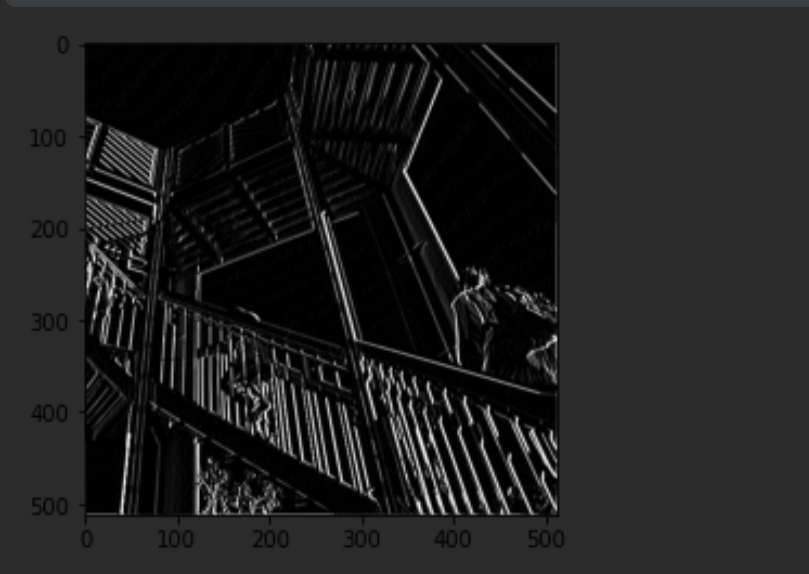
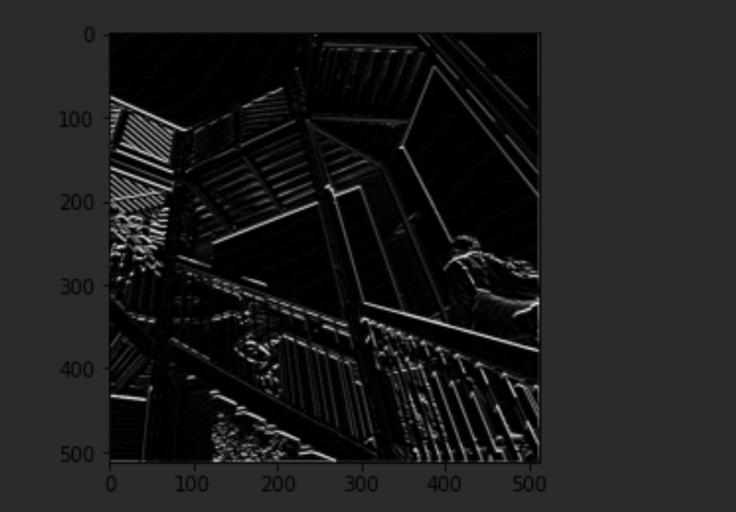
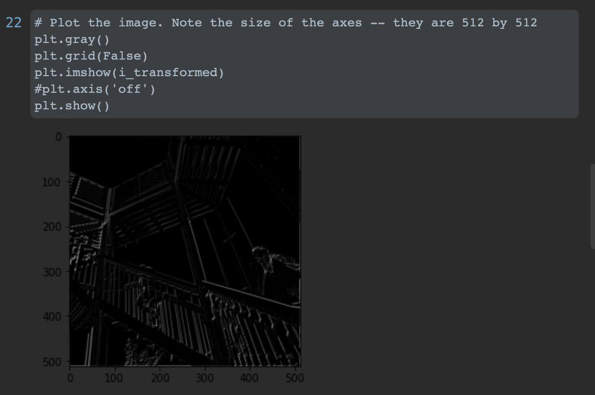

# Feb.07 Informal Response 
### Victoria Yuanyuan Chang

#### A. Convolutions
1. filter = [ [-1, -2, -1], [0, 0, 0], [1, 2, 1]] This filter accentuates vertical lines in the image.

Output:

2. filter = [ [-1, 0, 1], [-2, 0, 2], [-1, 0, 1]] This filter accentuates horizontal lines in the image.

Output:

3. filter = [ [1, 0, 0], [ 0, 0, 0], [0, 0, -1] ] This filter darkens the image.

Output:
