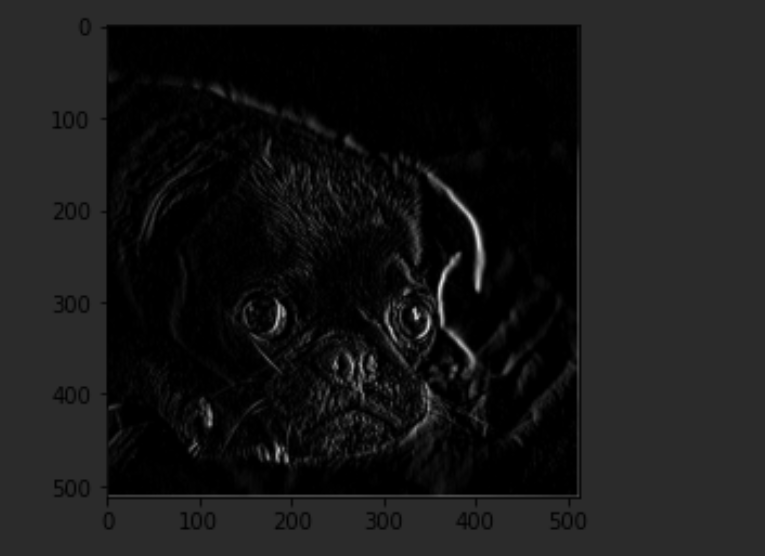
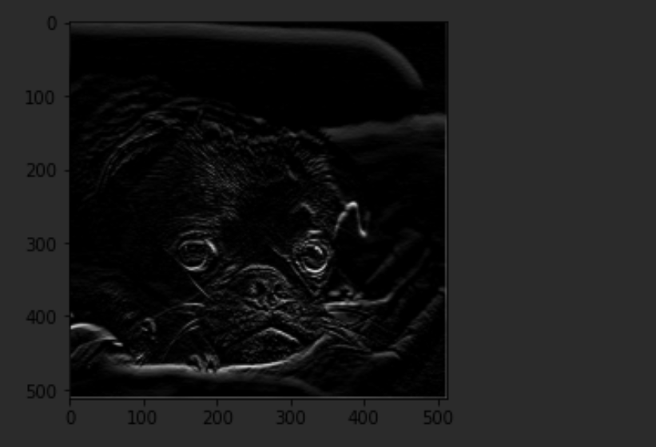
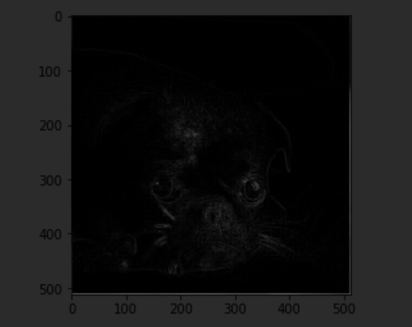

# Feb.17 Informal Response Update
### Victoria Yuanyuan Chang
The following are images when three different filters are applied to an image of a pug. The filters are: filter = [ [0, 1, 0], [1, -4, 1], [0, 1, 0]]
, filter = [ [-1, -2, -1], [0, 0, 0], [1, 2, 1]], and filter=[[1, 0, 0], [0 ,0 ,0], [0, 0, -1]].

The orignial image is: 

The convoluted and pooled images are:

