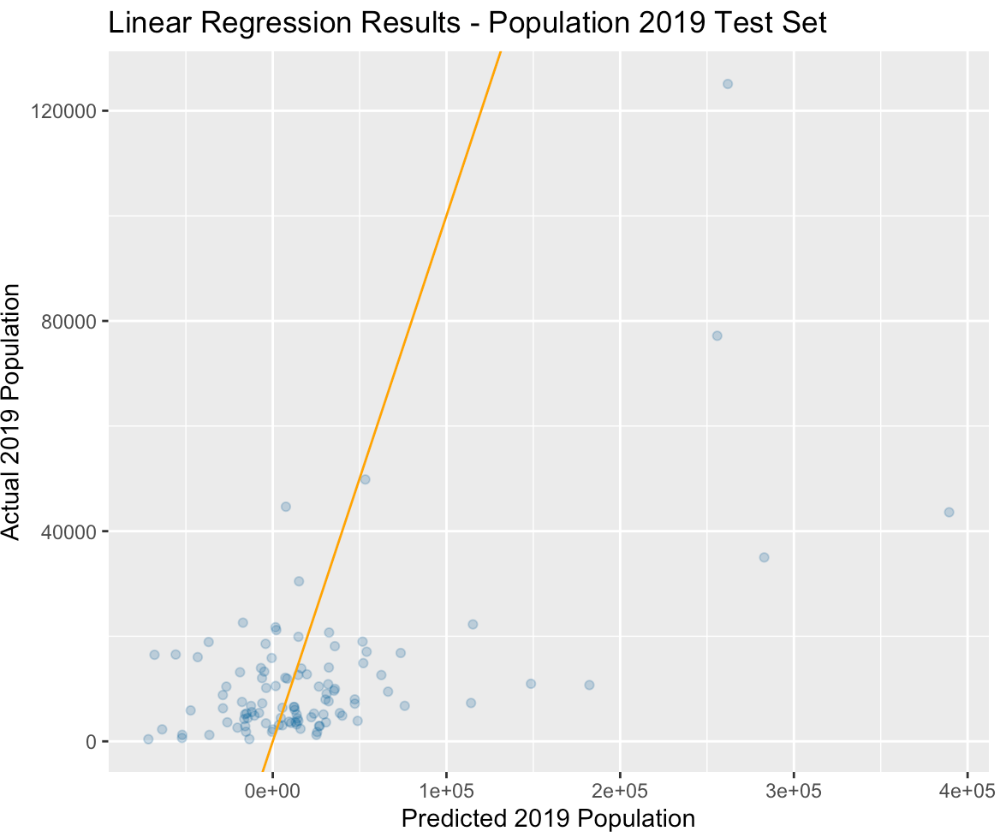
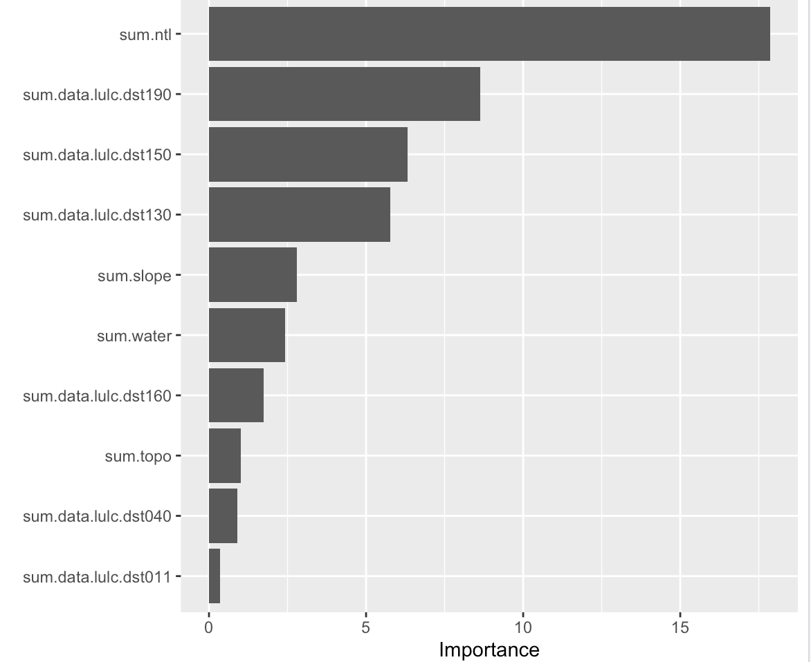

# Mar.22 Informal Response
### Victoria Yuanyuan Chang

The country I chose is Liberia. The resulting raster stack is the following:

The R^2 plot and the importance of each variable are shown below:

