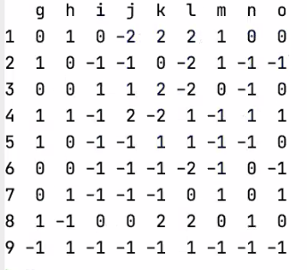
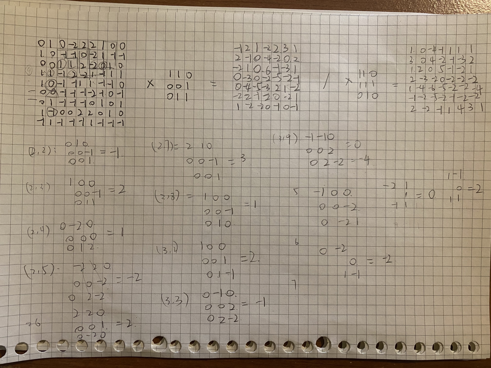

# Matrix Convolution
### Victoria Yuanyuan Chang

Convolve the two 3x3 matrices that were assigned to you with your 9x9 matrix and calculate the resulting two matrices.

The 9x9 matrix is: 
The first 3x3 matrix is: [ [1, 1, 0], [0, 0, 1], [0, 1, 1] ]

The resulting matrix is:
```[[-1,2,1,-2,2,3,1],
    [2,-1,0,-4,-2,0,2],
    [-2,1,0,6,-1,-3,1],
    [0,-3,0,-2,-5,-2,-1],
    [0,-4,-5,-3,2,1,-2],
    [-2,2,-1,2,0,-2,1],
    [1,-2,-2,0,-1,0,-1]]
```
The second 3x3 matrix is: [ [1, 1, 0], [1, 1, 1], [0, 1, 0] ]

The resulting matrix is:

```[[1,0,-4,-1,1,1,1]
   [3,0,4,-2,-1,-3,2],
   [1,2,0,5,-1,-2,1],
   [2,-3,-2,0,-2,-2,-2],
   [1,-4,-6,-5,-2,-2,-4],
   [-1,-2,-5,-2,-1,-2,-2],
   [2,-2,-1,1,4,3,1]]
```
 
