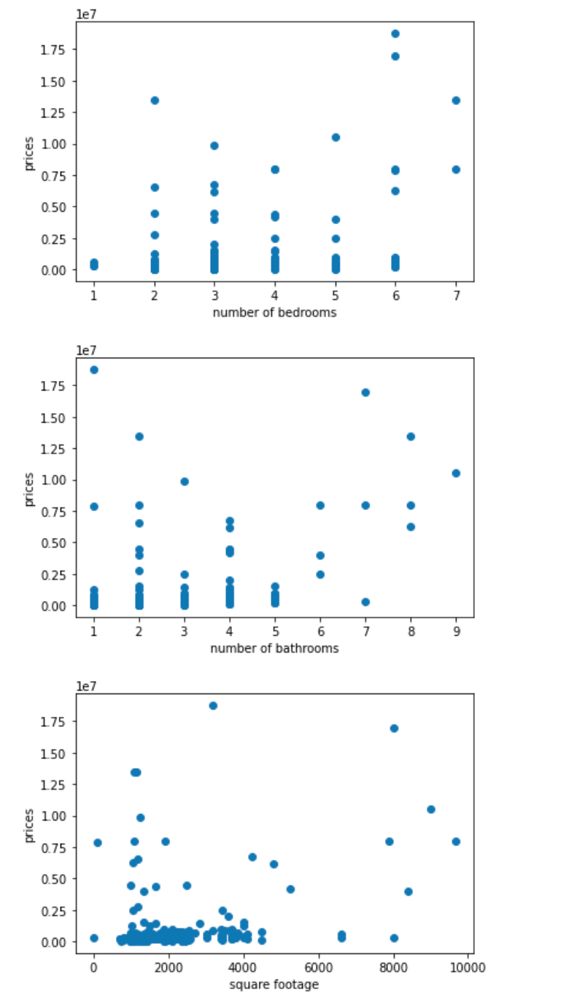
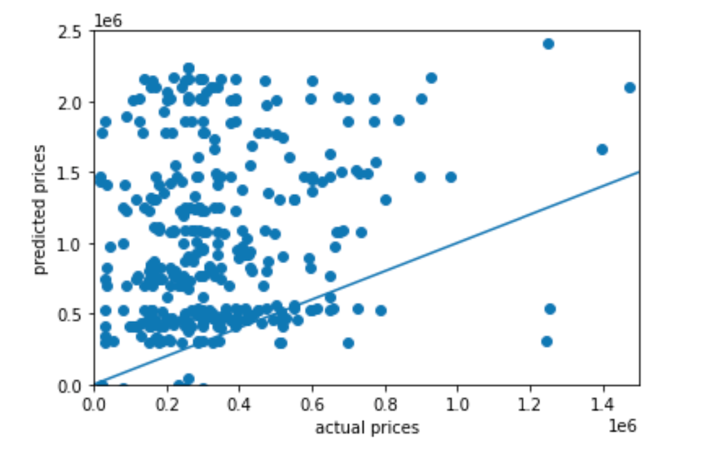
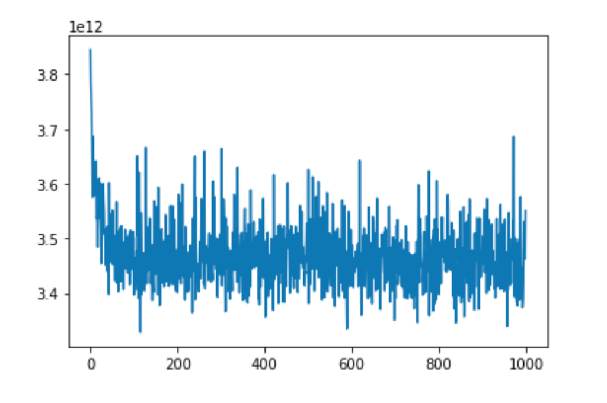
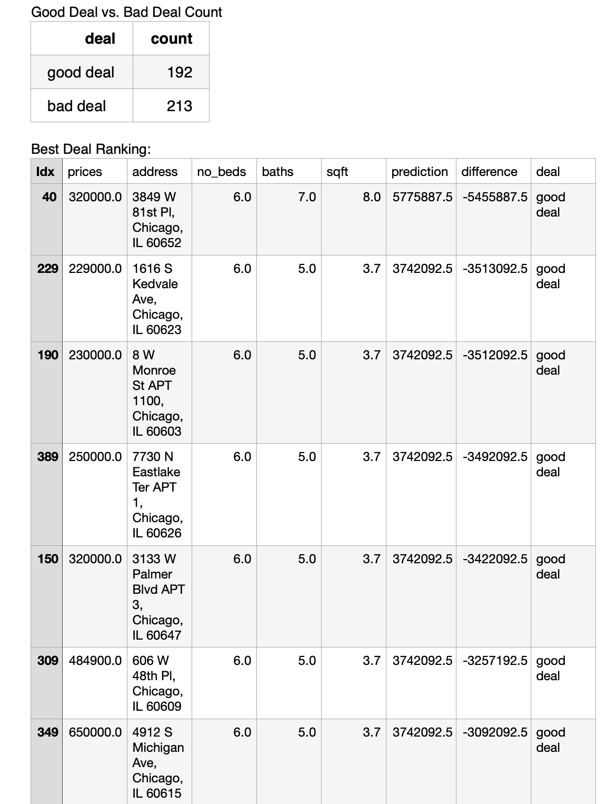

# Project 1
### Victoria Yuanyuan Chang

Select a city and scrape as many observations as possible from zillow. Try to obtain at least 400 observations from your selected location.
Clean the housing data you obtained and create a number of usable features (independent variables) and targets (dependent variables). Set price as the response variable, and then set numbers of beds, number of bathrooms and total square footage as the predictors.
Following the previous model you specified (6 houses in Mathews), import your new data set and train a new model on your target and features.

Write a one and a half to two page report on your results and include the following.

### 1. A description of the housing data you scraped from zillow:

The city I chose is: Chicago, IL

559 initial data points are collected. However, some are missing information (mostly the square footage), and are therefore eliminated.  After cleaning the invalid entries, information of 405  Chicago housing are used for model training. The following are descriptive statistics of the data collected. 

|measure  |  prices | no_beds   |    no_baths    |     sqft |
|------|----------|-------------|-----------|--------|
|count | 405    |    405 | 405 | 405 |
|mean |  788,748.50    |      3.11  |  2.54 | 1902.65 |
|std  |  2020,120.00|   1.06 |   1.19  | 1210.58 |
|min  |  17,500.00    |     1.00  |  1.00 | 312.00 |
|25%  |  215,000.00    |     2.00  |  2.00 | 1200.00|
|50%  |   305,000.00  |       3.00 |  2.00 | 2277.00 |
|75%  |   499,900.00   |      4.00  |  3.00 | 9672.00 |
|max  | 1875,000.00 | 7.00| 9.00| 9672.00

As shown in the table, the housing data show great variance, with the prices ranging from $17,500.00 to 18750,000.00 and square footage ranging from 312 sqft to 9672 sqft. On the other hand, the number of bathrooms and bedrooms are less varied, with a standard deviation of 1.06 and 1.19, respectively. With no surprise, the housing that have similar prices or square footage tend to have the same zip code and are likely from the same neighborhood judging from the address.

### 2. A description of your model architecture:

The model captures the first 14 pages of the research result of Chicago housing on Zillow, preprocess the data and extract the number of beds, number of baths, prices, and square footage of each housing listed, and convert these information into a .csv file. For the convenience of model training, the square footage was divided by 1000 before being fitted to the neural network. The neural network consists of one dense layer. It takes in the number of beds, number of baths and square footage of each housing and train on these information to predict the housing price. The model is compiled with optimizer=‘sgd', and loss=‘mean_squared_error’, and is fitted to the data by an epoch of 1000.

### 3. An analysis of your model output:

The Mean Squared Error of the Top10 Under-estimations is:  83759434270787.19. The Mean Squared Error of the Top10 Over-estimations is:  5453262586140.667. The Mean Squared Error of the Top10 accurate estimations is:  103158038.2795139. The most accurate 10 predictions are ranked 188-197(46-49th percentile) out of 405 data, therefore, the model has a slight tendency to underestimation. The most overly estimated housings are the ones with more rooms, more sqaurefootage, and therefore priced higher. This is could partially be accounted by that the larger data skewed the prediction to a larger extent, or it could be that they were indeed seriously over-priced.

The  Mean Squared Error of the predictions is 2907264118198.8569, and after standard scaling, the MSE becomes 3393509392384.0000. Therefore standard scaling may not have improved the model. This perhaps is due to the fact that the input data does not vary much in value range (after the square footage is divided by a thousand). 

### 4. An analysis of the output that assesses and ranks all homes from best to worst deal:

The model defines good deals as the housing whose actual price is lower than the predicted price and bad deals as those whose actual prices is higher than the predicted price. For the purpose of bug avoidance, fear deal is defined as housings having actual prices matching the predicted price. With no surprise, no fair deal is found. The model has identified 192 good deals, with the actual price lower than the estimation by $9,304.00 to $3818,170.00. The rest are identified as bad deals, with predicted prices lower than the actual prices  by $2,146.13 to $128,618.30. Noticeably, one housing is classified as a bad deal, but as its predicted price is only higher than the actual price by $146.125, which could be considered as a fair deal. I could have set up a price range for fair deals, but I think such a price range would be subjective and arbitrary, so I end up using this simple dichotomy. 

### 5. Include at least three plots that support your project report:
#### A plot to describe the source data would make sense: 
The relationship between the asking price of the housings and thier number of bedrooms, bathrooms, and square footage:

  
#### A plot to describe the model output:
The scatter plot of actual prices (x-axis) vs. predicted priced (y-axis):
 
  
The progression of loss: 

  
#### A plot that compares the predicted value with the given value to estimate the best buys:
  
  
#### Attachments
  
  See full ranking [here.](/DATA-310/ranked.csv)
  
  See orignial data pulled from Zillow [here.](/DATA-310/out.csv)
