# Project 2
### Victoria Yuanyuan Chang

Project 2, due Wednesday, March 24th by midnight

## Model 1
Using the R script provided, split and sample your DHS persons data and evaluate the AUC - ROC values you produce.
#### 1. Which "top_model" performed the best (had the largest AUC)?

The top_models are the following:
```
  penalty .metric .estimator  mean     n std_err .config              
      <dbl> <chr>   <chr>      <dbl> <int>   <dbl> <chr>                
 1 0.0001   roc_auc hand_till  0.617     1      NA Preprocessor1_Model01
 2 0.000127 roc_auc hand_till  0.617     1      NA Preprocessor1_Model02
 3 0.000161 roc_auc hand_till  0.617     1      NA Preprocessor1_Model03
 4 0.000204 roc_auc hand_till  0.617     1      NA Preprocessor1_Model04
 5 0.000259 roc_auc hand_till  0.617     1      NA Preprocessor1_Model05
 6 0.000329 roc_auc hand_till  0.617     1      NA Preprocessor1_Model06
 7 0.000418 roc_auc hand_till  0.617     1      NA Preprocessor1_Model07
 8 0.000530 roc_auc hand_till  0.616     1      NA Preprocessor1_Model08
 9 0.000672 roc_auc hand_till  0.616     1      NA Preprocessor1_Model09
10 0.000853 roc_auc hand_till  0.616     1      NA Preprocessor1_Model10
11 0.00108  roc_auc hand_till  0.616     1      NA Preprocessor1_Model11
12 0.00137  roc_auc hand_till  0.615     1      NA Preprocessor1_Model12
13 0.00174  roc_auc hand_till  0.614     1      NA Preprocessor1_Model13
14 0.00221  roc_auc hand_till  0.613     1      NA Preprocessor1_Model14
15 0.00281  roc_auc hand_till  0.612     1      NA Preprocessor1_Model15

```
lr_best returns ```0.00108 roc_auc hand_till  0.616     1      NA Preprocessor1_Model11```, therefore model 11 performed the best.

The AUC-ROC to penalty curve is shown as below:
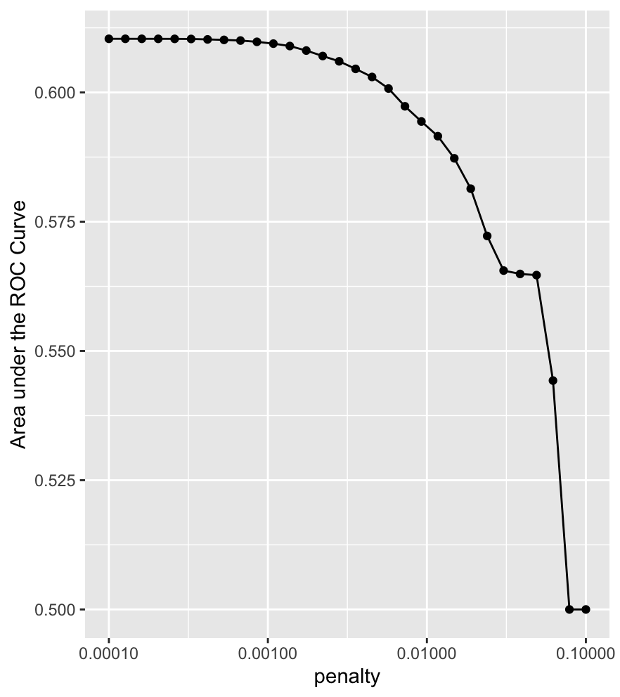

#### 2. Are you able to use the feature selection penalty to tune your hyperparameter and remove any potentially irrelevant predictors? Provide justification for your selected penalty value? 

I selected a penality value of 0.00108, as it is the penalty value f model11, the best performing model. With this penalty value the model seems to have larger AUC, so it should be able to remove some irrelevant predictors. 

#### 3. Finally, provide your ROC plots and interpret them. How effective is your penalized logistic regression model at predicting each of the five wealth outcomes.


Above is the ROC plot of the best-performing penalized logistic regression model. As shown in the graph, the penalized logistic regression model is best at identifying the 5th wealth outcome from the general population. It has some predictive power for the 4th and the 1st outcome, but it's less distinguishable than the 5th. The AUC for the 2nd and 3rd wealth outcomes are quite small, so its performance on predicting these two stratas are pretty bad.

## Model 2
Using the R script provided, set up your random forest model and produce the AUC - ROC values for the randomly selected predictors, and the minimal node size, again with wealth as the target.
#### 1. How did your random forest model fare when compared to the penalized logistic regression?
The best-performing random forest models are the following:

```
   mtry min_n .metric .estimator  mean     n std_err .config              
  <int> <int> <chr>   <chr>      <dbl> <int>   <dbl> <chr>                
1     2    34 roc_auc hand_till  0.624     1      NA Preprocessor1_Model21
2     2    36 roc_auc hand_till  0.624     1      NA Preprocessor1_Model18
3     2    31 roc_auc hand_till  0.623     1      NA Preprocessor1_Model07
4     2    24 roc_auc hand_till  0.623     1      NA Preprocessor1_Model12
5     2    20 roc_auc hand_till  0.623     1      NA Preprocessor1_Model14
```
The best performing random forest has an AUC vlaue of 0.624, while that of the best logistic regression model is 0.616. Comparing the AUC-ROC values of the random forest models to that of the logistic regression, the performance of the random forest is better han the penalized logistic regression. Comparing the AUC plots, on the other hands, the random forest model and the logitsic regression model seem to have very similar performance.

The comparison of the AUC-ROC curves between the random forest models and the logistic regression models are shown as the following:
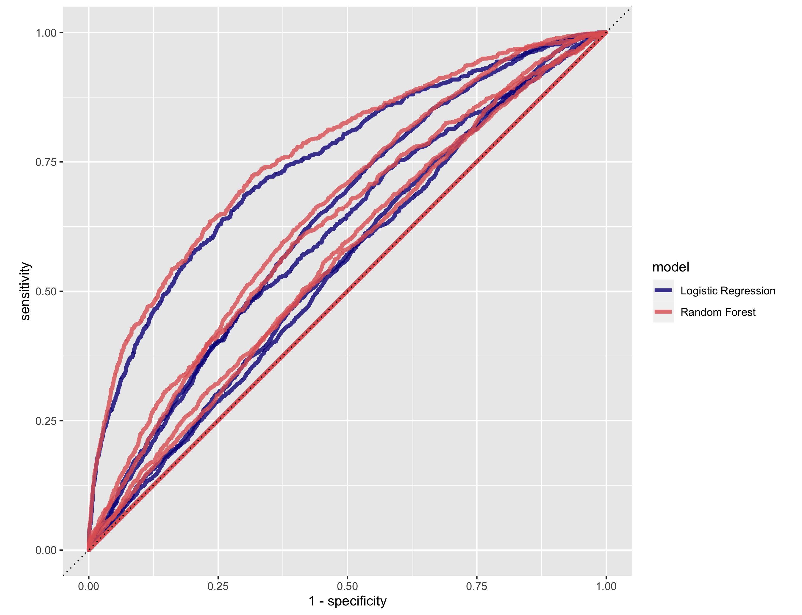

#### 2. Provide your ROC plots and interpret them.
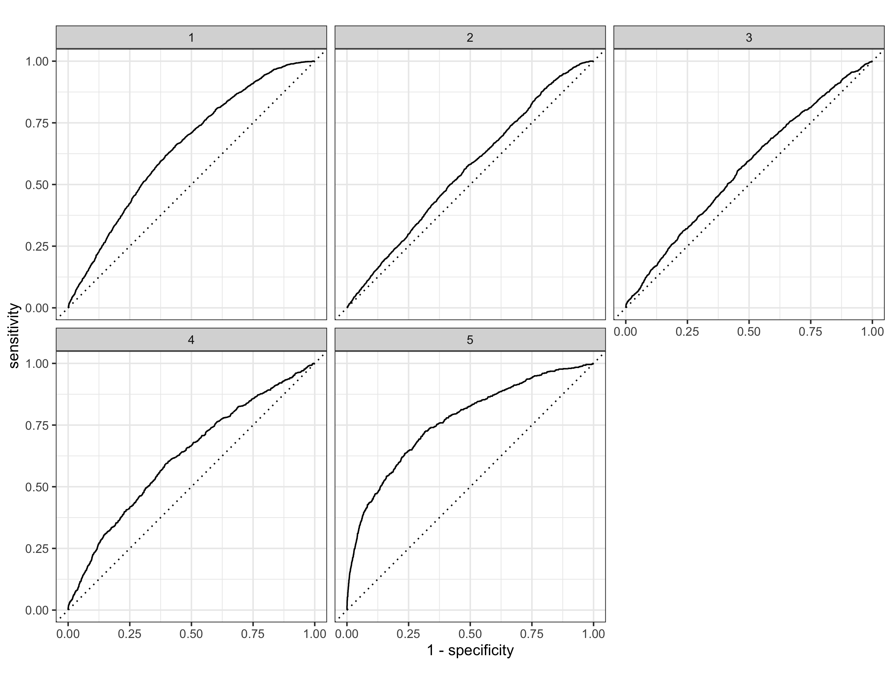

As shown in the graph, the performance of the random forest model is quite similar to that of the logistic regression. It is best at predicting the 5th wealth strata; it has some validity in predicting the 1st and the 4th strata, while it has limited capacity in identifying the 2nd and the 3rd stratas.

#### 3. Are you able to provide a plot that supports the relative importance of each feature's contribution towards the predictive power of your random forest ensemble model?

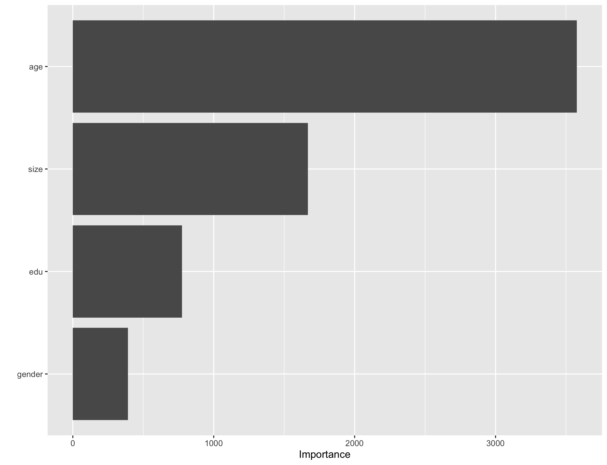

## Model 3
Using the python script provided, train a logistic regression model using the tensorflow estimator API and your DHS data, again with wealth as the target. Apply the linear classifier to the feature columns and determine the accuracy, AUC and other evaluative metrics towards each of the different wealth outcomes. Then continue with your linear classifier adding the derived feature columns you have selected in order to extend capturing combinations of correlations (instead of learning on single model weights for each outcome). 

The evaluative metrics of the model on each wealth outcome category:
 
| metric | wealth 1 | wealth 2 | wealth 3 | wealth 4| wealth 5|
|----------|--------|----------|----------|---------|---------|
|accuracy          |  0.689755   |0.734467| 0.789631 |  0.878225 |     0.905019|
|accuracy_baseline  |   0.689341  |0.734467|  0.789880  |0.878225 |    0.905019|
|auc                 |   0.626103  | 0.544592| 0.549647  | 0.593159|   0.708009|
|auc_precision_recall |  0.408918   |0.286442 | 0.236636 | 0.175663 |  0.291073|
|average_loss          | 0.597824   |0.575775 | 0.512214  | 0.364653|  0.290561|
|label/mean             |  0.310659 |0.265533 |0.210120  | 0.121775  | 0.094981|
|loss                  | 0.597824  |0.575775 |0.512214 | 0.364653  | 0.290561|
|precision           | 0.575758   | 0.000000 | 0.000000 | 0.000000   | 0.000000|
|prediction/mean      |  0.307808  |0.265849   | 0.211737 | 0.132364  | 0.102530|
|recall               |  0.005073  |0.000000   | 0.000000  | 0.000000 | 0.000000|
|global_step          |  100.000000  |100.000000  | 100.000000  | 100.000000  | 100.000000|


#### 1. produce your ROC curves and interpret the results.
Wealth 1: 
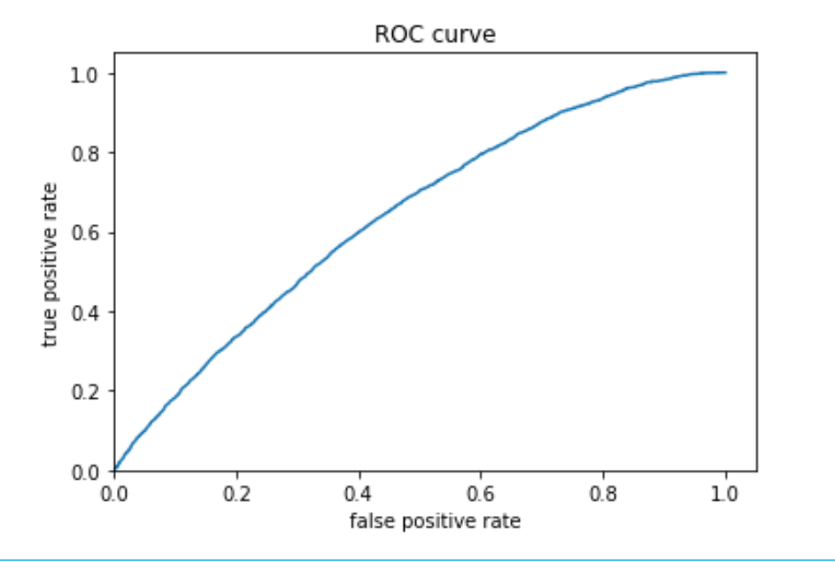
Wealth 2: 
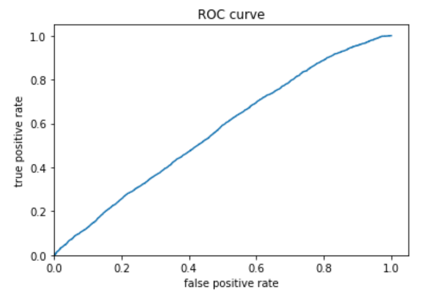
Wealth 3:
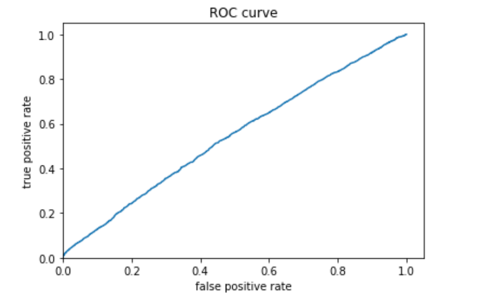
Wealth 4:
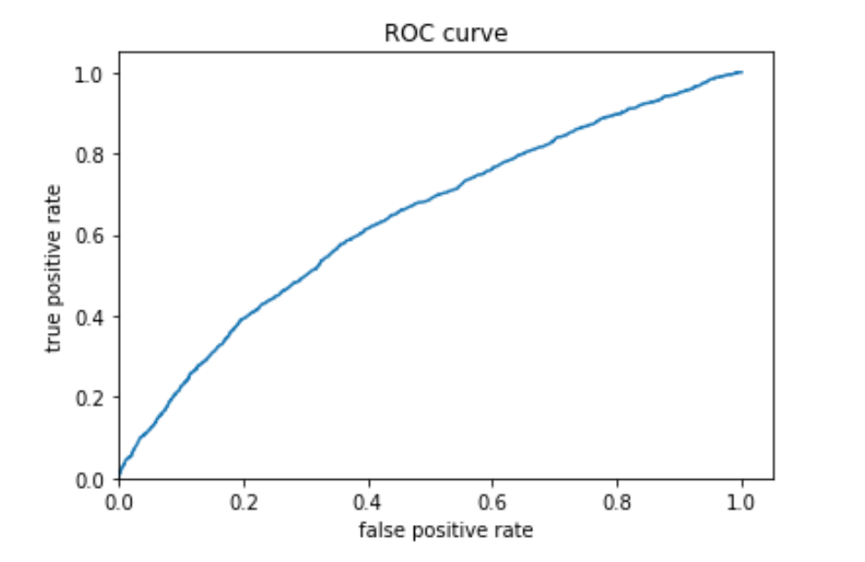
Wealth 5:
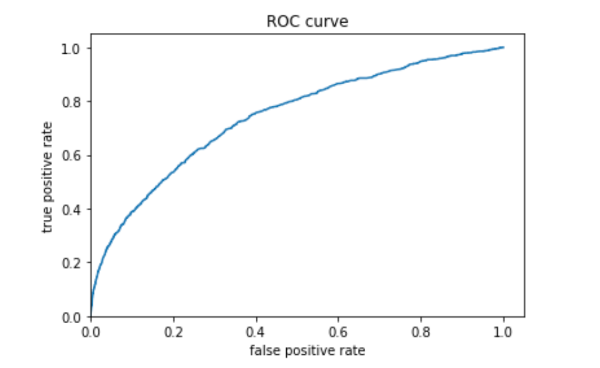

Similar to model 1 and model 2, model 3 is better at predicting wealth outcomes at extreme than in the middle. Moreover, as the metrics show, on average the AUC of this model is higher than that of model 1 and 2. Judging by the AUC values, then, model 3 has a better performance than Model 1 and 2.

## Model 4
Using the python script provided, train a gradient boosting model using decision trees with the tensorflow estimator. 

#### 1. Provide evaluative metrics including a measure of accuracy and AUC. 

| metric | wealth 1 | wealth 2 | wealth 3 | wealth 4| wealth 5|
|----------|-------------|------|-----|-----|-----|
|accuracy          |  0.689672 | 0.734467  | 0.790875 |  0.879054 |     0.909996|
|accuracy_baseline  |   0.689341 | 0.734467   |0.789880  | 0.878225 |    0.907341|
|auc                 | 0.635256 | 0.567539  |0.567691   |  0.635940|   0.737803|
|auc_precision_recall | 0.409544| 0.306443 |0.265202 | 0.209361 |  0.292773|
|average_loss       |  0.591484 | 0.569547  |0.507758 | 0.356499  | 0.271809|
|label/mean          |  0.310659 |0.265533  |    0.210120 |  0.121775 |   0.092659|
|loss                 |  0.591484|0.569547 | 0.507758 | 0.356499 |        0.271809|
|precision            | 0.571429| 0.500000 | 0.800000 | 0.857143 |       0.611111|
|prediction/mean      |  0.306497|0.263522 | 0.209425 |  0.126440 |      0.092366|
|recall              |    0.004272 |0.002187 | 0.006317| 0.008174  |     0.078782|
|global_step         |  100.000000|100.000000 | 100.000000  |100.000000  |  100.000000|


#### 2. Produce the predicted probabilities plot as well as the ROC curve and interpret these results.
wealth 1:
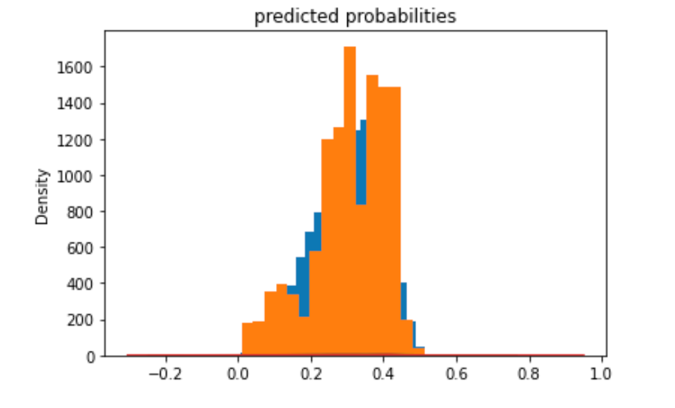
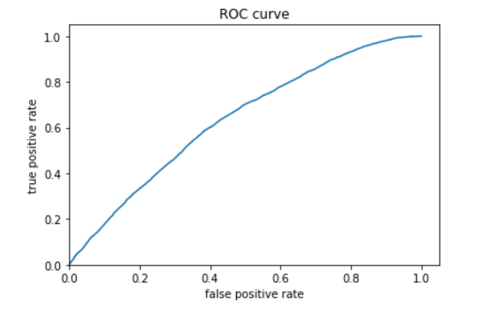
wealth 2:
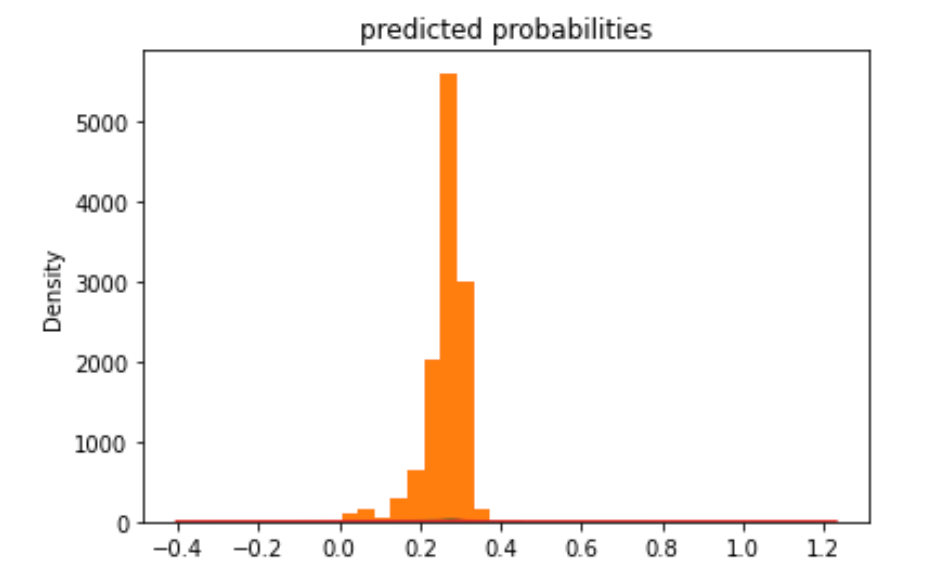
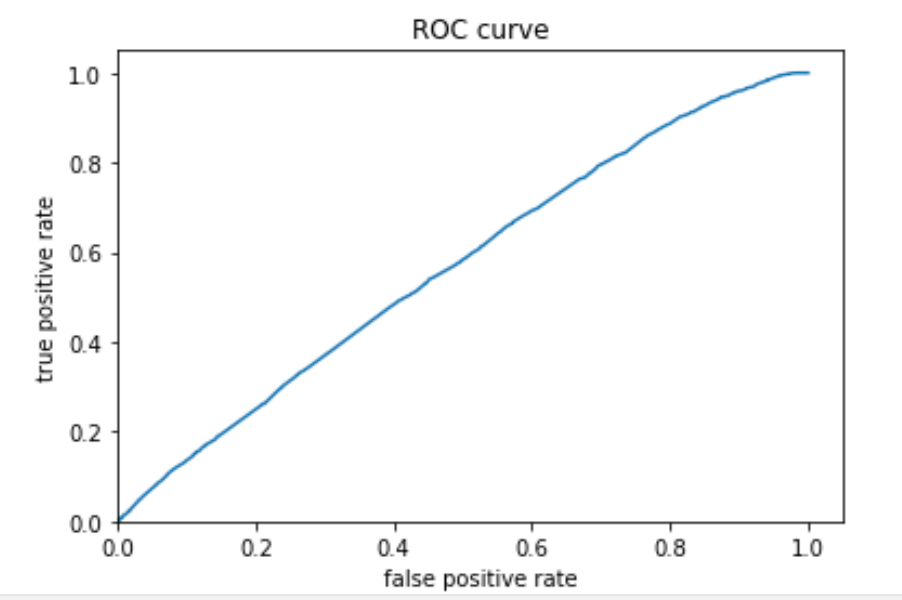
wealth 3:
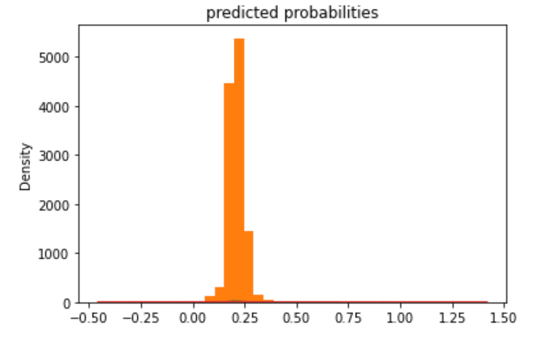
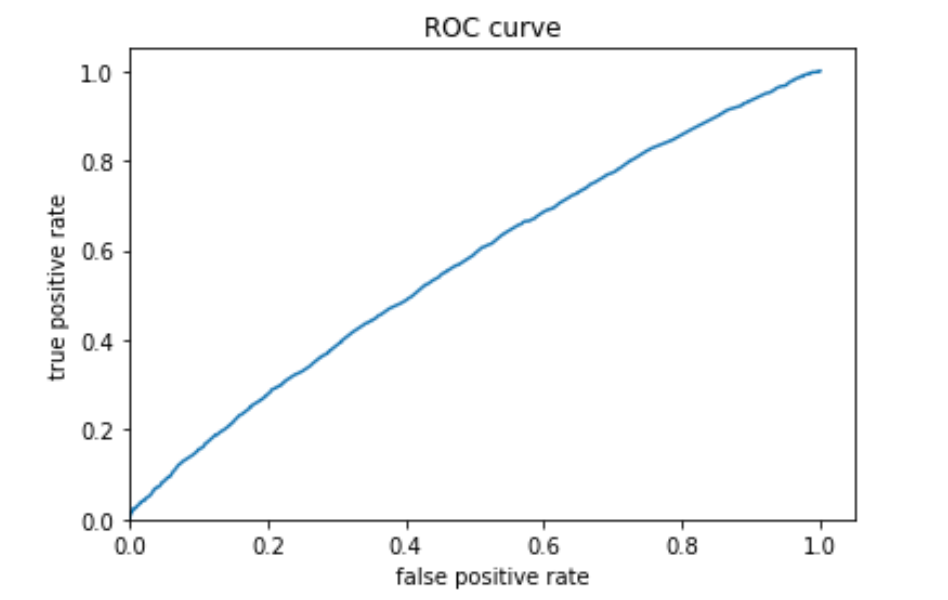
wealth 4:
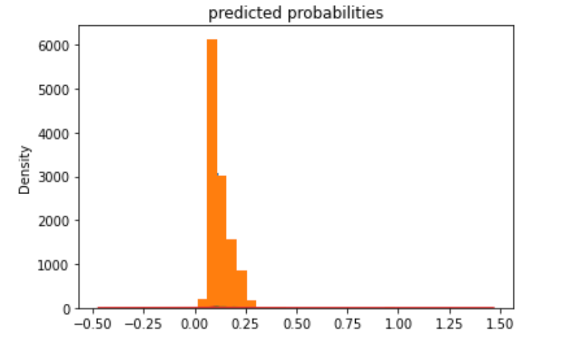
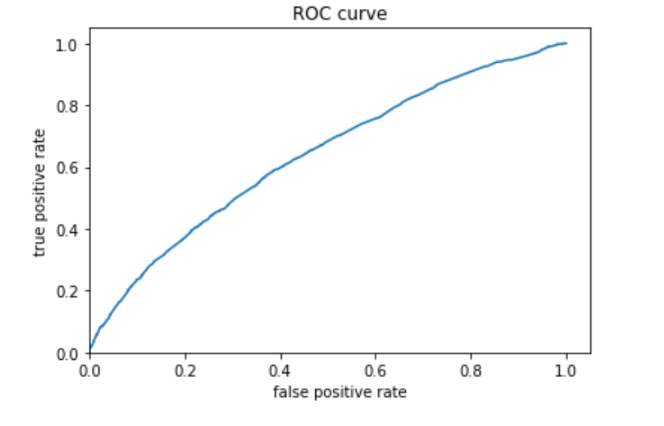
wealth 5:
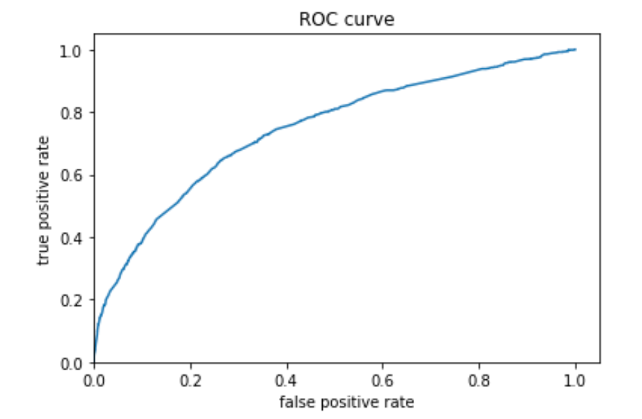
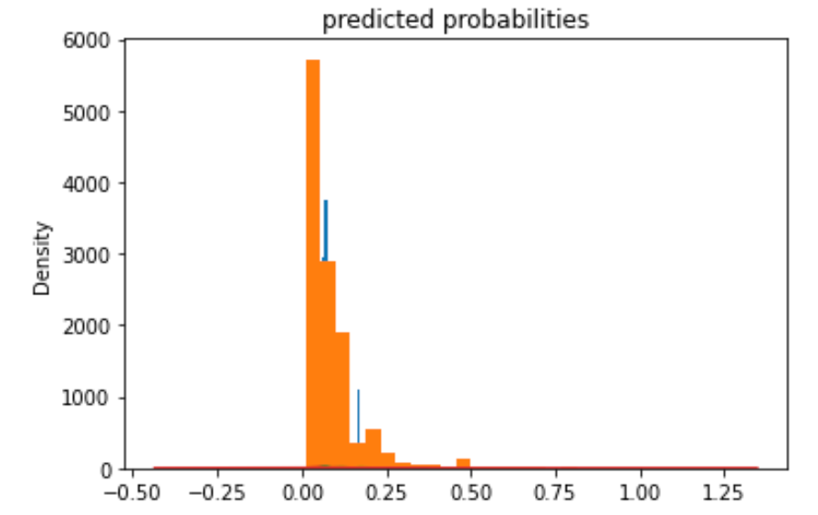

Similar to the previous models, model 4 is better with the extreme wealth outcomes than with those in the middle. Model 4 is best at predicting the 5th wealth outcome, with an AUC of 0.738, the highest of all models. It has a moderate predictive power over the 1st and the 4th wealth outcomes, and its performance is worst in predicting the 2nd and the 3rd outcomes. Although it is not as good as predicting wealth outcomes in the middle, it has a decent AUC for wealth 2 and 3, a slight improvement comparing to the other models. Overall, I think this model has good predictive power. In line with the AUC values, the predicted probabilities of the 1st and the 5th wealth outcomes are higher than that of the 2nd and the 3rd as the model is more capable of predicting outcomes at both ends.

## Analyze all four models. 

#### 1. According to the evaluation metrics, which model produced the best results? 
According to the AUC values of each model, model 4 seems to have produced the best results.

#### 2. Were there any discrepancies among the five wealth outcomes from your DHS survey dataset?
All of the models have shown similar trends in predicting different stratas of wealth outcomes. The second and the third stratas of the wealth outcomes are the hardest to predict, while all models perform the best for the fifth strata. Overall, the models perform better for those who are extremely wealthy or poor, while its performance drops significantly for those in the middle. 
