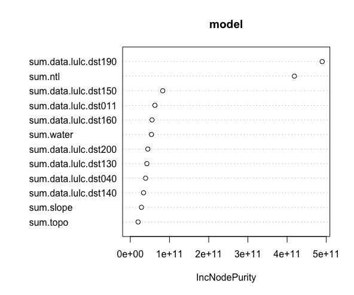

# Project 3
### Victoria Yuanyuan Chang

Using two machine learning methods predict population values at 100 x 100 meter resolution throughout your selected country.
Validate the two models using different methods presented in this class, write a report assessing the two approaches and which of the two models was more accurate. Be sure to account for spatial variation throughout your selected location and provide substantive explanations for why those variations occurred.

The country I chose for this project is Liberia.

### 1. Linear Regression Model:

Linear regression results:

The relatve importance of each factor:

Population sums: 

Diff Sums:

3D plot of diff sums:

As shown in the plot, the model tends to underpredict the population, except for the capital area. This is likely due to the relatively larger number of populations in the capital area.

Model validation: MSE vs. MAE

MSE:

MAE:

Calculated using CellStats, MAE = 1852354 and MSE = 15902959.

### 2. Random Forest

The relatve importance of each factor:

Population sums: 

Diff Sums:

3D plot of diff sums:

As shown in the plot, the model tends to underpredict the population, except for the capital area. This result is similar to that of the linear regression.

Model validation: MSE vs. MAE

MSE:

MAE:

Calculated using CellStats, MAE = 1906480 and MSE = 15953265.

## 3. Comparison of the two models:
Judging from the resulting plots, the two models do not differ much in terms of predictive power and accuracy. Comparing the MSE and MAE of the two models, on the other hand, the linear regression model out-perform the random forest model.
