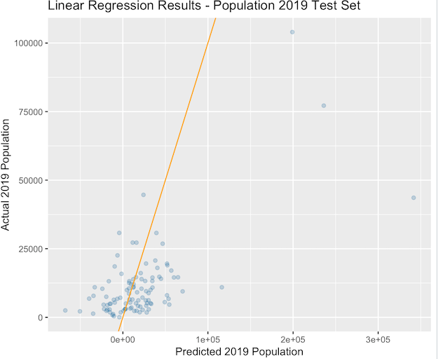

# Project 3
### Victoria Yuanyuan Chang

Using two machine learning methods predict population values at 100 x 100 meter resolution throughout your selected country.
Validate the two models using different methods presented in this class, write a report assessing the two approaches and which of the two models was more accurate. Be sure to account for spatial variation throughout your selected location and provide substantive explanations for why those variations occurred.

The country I chose for this project is Liberia. Below is a map of the country. As shown in the map, Monrovia is the capital of Liberia. The capital area is the most densely populated region of the country.

### 1. Linear Regression Model:
13 variables were used to predict the population of each region. The actual population data comes from the Worldpop data of Liberia's population distribution in 2019. Data were splitted into training and testing sets and a linear regression model is trained and used to predict the population distribution.

Linear regression results are shown below:

The relatve importance of each factor in predicting the population:

The plotted predicted population (upper image) as compared to the actual distribution of population (lower image):

 

#### Model Validation
Comparing the image of the predicted population and the actual population, the model seems to have more errors predicting the population of the areas around the capital. The plots of difference between the predicted value and the actual value (diff_sums = pred-actual) provides us a closer look.
Diff Sums:

3D plot of diff sums:

As shown in the plots above, while the population of the whole country is slightly underpredicted, the error of prediction in the capital area is more prominent, with some regions being overpredicted and others largely underpredicted. This clustering of error could be due to the relatively larger number of population in the capital area. As the base number goes up, difference in prediction also becomes larger. The larger contrast of population density of different area within this relative small greographical region (which means they differ little in the data used to predict population) may also account for reduced accuracy of the model in this area.

There are two approaches to validate the model: Meam Squared Error (MSE) and Mean Absolute Error (MAE). Both are plotted below:

MSE:

MAE:

Calculated using CellStats, MAE = 1852354 and MSE = 15902959. In line with the analysis of diff_sums, the errors cluster around the capital area.

### 2. Random Forest
Similar to the linear regression model, 13 variables were used to predict the population of each region. The actual population data comes from the Worldpop data of Liberia's population distribution in 2019. Data were splitted into training and testing sets and a random foress model is trained and used to predict the population distribution.

The relatve importance of each factor in predicting the population distribution:

The plot of error over number of trees in the model:

As shown in the plot, increasing the number of trees does not significantly improve the accuracy of the model after less than 50 tress.

The plotted predicted population (upper image) as compared to the actual distribution of population (lower image):

 

The precdiction made by the random forest model seems to be fairly similar to that of the linear regression, both haviing larger errors around the capital region.

#### Model Validation 

The plot of diff_sums (predicted value - actual values)

3D plot of diff sums (angled to show better details):

As shown in the plot, the model tends to underpredict the population overall, while having mixed errors in the capital area. This result is similar to that of the linear regression.

Model validation: MSE vs. MAE

MSE:

MAE:

Calculated using CellStats, MAE = 1906480 and MSE = 15953265.

## 3. Comparison of the two models:

Above is the comparison between the difference of predicted value and actual value of the population by the linear regression model (upper) and the random forest model (lower). Judging from the resulting plots, the two models do not differ much in terms of accuracy and tendency in making errors, although a closer look may reveal that overall, the linear regression's nationwide underprediction is weaker than that of the random forest.

Comparing the MSE and MAE of the two models, on the other hand, the linear regression model out-perform the random forest model.

